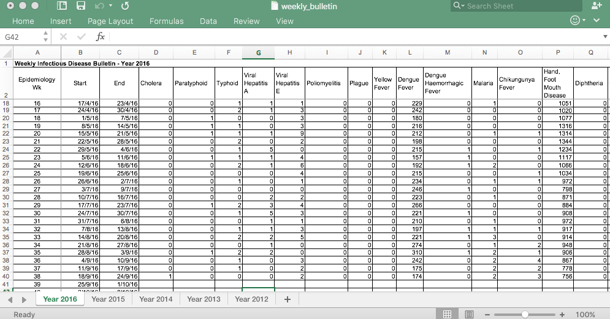
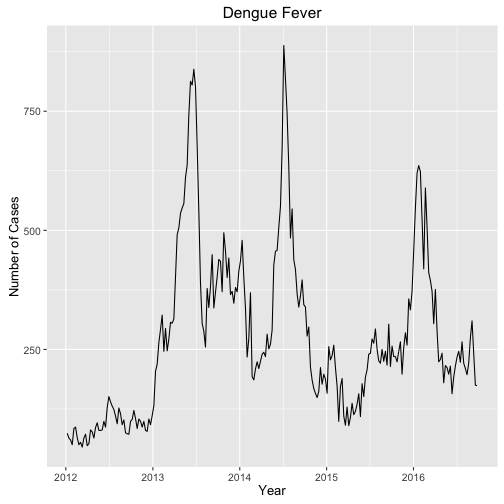
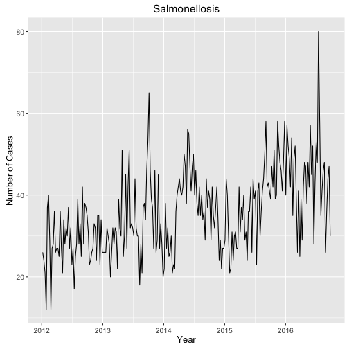
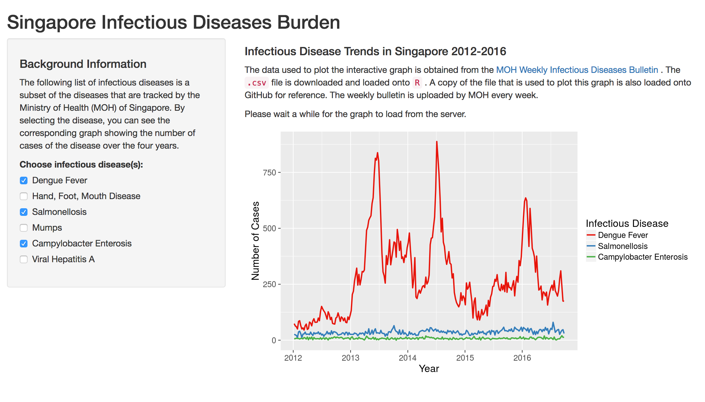

Impact of Infectious Diseases in Singapore
========================================================
author: Zhang Jinyan
date: 11 October 2016
autosize: true
transition: rotate
font-family: "Helvetica"

 
<small>
Done in submission to Coursera Data Science Specialization:
 
Developing Data Products
</small>

Infectious Disease Burden
========================================================

Understanding the infectious disease burden in a community helps guide our allocation of resources and responses in these areas of need.

Examples of infectious diseases with high incidences based on [MOH Weekly Infectious Diseases Bulletin](https://www.moh.gov.sg/content/moh_web/home/statistics/infectiousDiseasesStatistics/weekly_infectiousdiseasesbulletin.html):

- Dengue Fever
- Hand, Foot, Mouth Disease
- Mumps
- Campylobacter Enterosis
- Salmonellosis
- Viral Hepatitis A

Weekly Infectious Diseases Bulletin
========================================================

A screengrab of the bulletin `.csv` file:

Dengue Fever and Salmonellosis 
========================================================

***

Shiny Application
========================================================

<small>Using the [Shiny Application](https://jyzhang.shinyapps.io/plotId/) allows users to browse through different infectious diseases to see their trends and burdens.</small>

Summary Slide
========================================================
- Done presentation using RStudio Presentation
- Included codes for displaying of graphs with `ggplot2`
- Embedded screengrab images
- Embedded links to data set and shiny application
- Uploaded presentation on GitHub
- Slides hosted on GitHub Page
